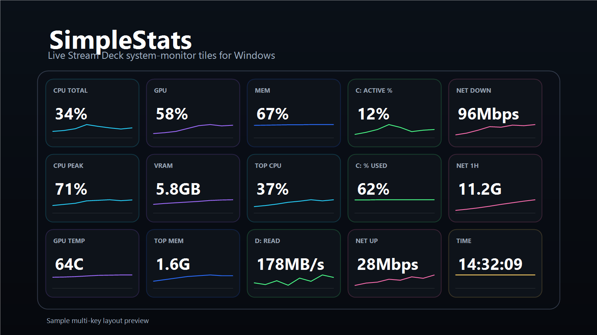

# SimpleStats for Stream Deck

Real-time Windows system monitoring on your Stream Deck. Each key becomes a live tile — graph, value, and label — styled like a compact Task Manager widget.

## Install

Download the `.streamDeckPlugin` file from the [latest release](../../releases/latest) and open it. Stream Deck will install it automatically.

## Setup

Drag any of the six actions onto a key: **CPU**, **GPU**, **Memory**, **Disk**, **Network**, or **System**. Open the property inspector, pick a metric, and you're done. Each key updates every second.

Some metrics show additional options:
- **Source selector** — choose a specific CPU core, GPU, disk drive, or network interface
- **Alert %** — turn the value red when a percent metric crosses your threshold
- **Idle below** — show `IDLE` when a top-process metric is below your floor

## Metrics

### CPU
| Metric | Description |
|--------|-------------|
| Total Usage | Overall CPU load |
| Usage (Per-Core) | Single core with core picker |
| Usage (Peak Core) | Highest used core, labeled dynamically (e.g. `PEAK: C7`) |
| Top Process | Highest CPU consumer with app icon |
| Clock Frequency | Average speed across all cores (GHz) |

### GPU (NVIDIA)
| Metric | Description |
|--------|-------------|
| Core Usage | GPU utilization % |
| VRAM (%) | Video memory usage as a percentage |
| VRAM (GB) | Video memory used in gigabytes |
| Temperature | GPU temp with °C / °F toggle |
| Power (W) | Board power draw |
| Top Process | Highest compute consumer with app icon |
| Encoder (%) | NVENC hardware encoder load |
| Decoder (%) | NVDEC hardware decoder load |
| PCIe Download | GPU bus receive throughput |
| PCIe Upload | GPU bus transmit throughput |
| Core Clock (MHz) | Graphics clock speed |
| VRAM Clock (Effective MHz) | Memory clock at effective data rate |
| Fan Speed (%) | Fan RPM as a percentage of max |

### Memory
| Metric | Description |
|--------|-------------|
| Usage (%) |  |
| Used (GB) |  |
| Top Process (GB) | Largest memory consumer |
| Top Process (%) | Largest memory consumer |

### Disk
| Metric | Description |
|--------|-------------|
| Utilization (Active) | Per-drive active time |
| Used (%) | Drive capacity consumed |
| Free (%) | Drive capacity remaining |
| Read (MB/s) | Read throughput |
| Write (MB/s) | Write throughput |
| Top Process (I/O) | Highest disk I/O consumer with app icon |

Select a specific drive or use **Auto (Most Active)** to follow the busiest one. Each drive keeps its own graph history independently.

### Network
| Metric | Description |
|--------|-------------|
| Download (Mbps) | Receive rate |
| Upload (Mbps) | Transmit rate |
| Total Transfer | Cumulative bytes with 60s / 1h / 24h toggle |

Select a specific interface or **All** for aggregate. Transfer totals persist across Stream Deck restarts.

### System
| Metric | Description |
|--------|-------------|
| Clock | Live clock (HH:MM:SS) |
| Performance | Plugin diagnostics — tick stats, CPU%, heap |

## Features

- **60-second trend graph** on every key — crawls from right like Task Manager
- **Instant graph backfill** — new keys are pre-populated from cached data, even if they've never been on-screen
- **Top-process keys** show the process name with a faded app icon watermark
- **Background history** kept alive for 8 hours across page switches
- **Auto disk tracking** follows the busiest drive with independent per-disk graphs
- **Network totals** persist locally across restarts (minute-resolution, 24 hours)
- **Segmented button toggles** for temperature unit (°C/°F) and transfer period (60s/1h/24h)
- **Lightweight** — ~5 MB install, no external dependencies or admin privileges

## Requirements

- **Windows 10** or newer (build 10240+)
- **Stream Deck 6.9+**
- **NVIDIA GPU** with NVML-compatible drivers (for GPU metrics only)

## Notes

- All keys update at a 1-second cadence
- Metrics show `--` when data is temporarily unavailable
- Advanced GPU metrics show `N/A` when the driver doesn't expose that field
- Graph history resets when the Stream Deck app is fully closed
- Network transfer totals are only recorded while the plugin is running
